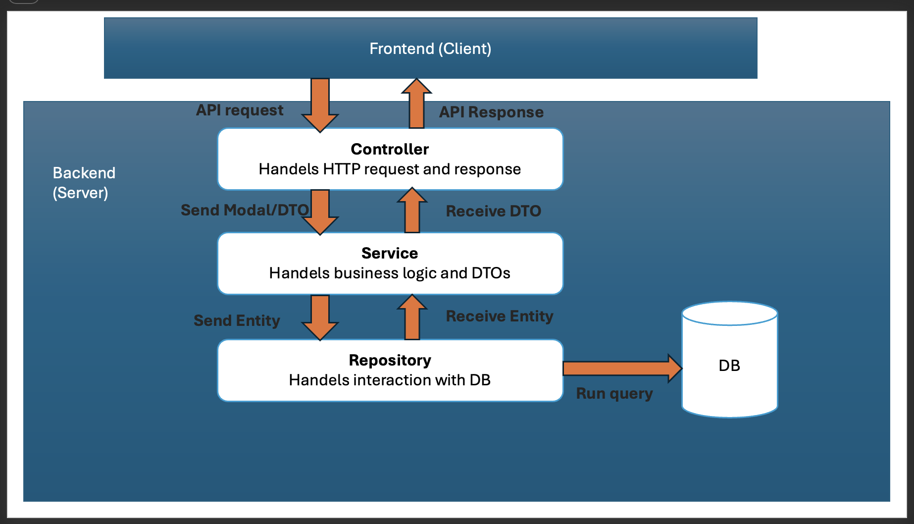

# Client-Management Project Setup

## Overview
**Client-Management** is a Spring Boot 3.5.7 REST API application for managing client information. It uses H2 in-memory database, JPA/Hibernate for ORM, and includes Swagger/OpenAPI documentation.

---

## Prerequisites

- **Java 21** (JDK 21 or later)
- **Maven 3.6+** (or use the included `mvnw` wrapper)
- **Git** (for version control)
- **IDE** (IntelliJ IDEA recommended)

---


## Installation & Setup

### 1. Clone the Repository
```bash
git clone <repository-url>
cd client-management
```

### 2. Build the Project
Using Maven wrapper (recommended - no Maven installation needed):
```bash
./mvnw clean install
```

Or using system Maven:
```bash
mvn clean install
```

**Output:** Creates `target/client-management-0.0.1-SNAPSHOT.jar`

### 3. Run the Application

**Option A: Using Maven**
```bash
./mvnw spring-boot:run
```

**Option B: Using Java (after building)**
```bash
java -jar target/client-management-0.0.1-SNAPSHOT.jar
```

**Option C: From IDE**
- Open `ClientManagementApplication.java`
- Click the green "Run" button or press `⌃⌘R` (Mac)

---

## Database Configuration

### H2 In-Memory Database
The application uses an **H2 in-memory database** configured in `application.yml`:

### Database Access
- **H2 Console URL:** `http://localhost:8080/api/v1/h2-console`
- **JDBC URL:** `jdbc:h2:mem:client_management_db`
- **Username:** `admin`
- **Password:** (leave blank)

---

## Architecture & Design


## API usage and endpoints

### Base URL
```
http://localhost:8080/api/v1
```

### API Documentation
- **Swagger UI:** `http://localhost:8080/api/v1/swagger-ui/index.html`
- **OpenAPI JSON:** `http://localhost:8080/api/v1/v3/api-docs`


### API Contract

#### Get All Clients (Paginated & Searchable)
```
GET /api/v1/clients?page=0&size=10&search=diana&orderBy=fullname&direction=asc

Response (200 OK):
{
  "content": [
    {
      "id": 11,
      "fullName": "Diana Prince",
      "displayName": "Diana P.",
      "email": "diana@prince.com",
      "details": "Diplomat and ambassador...",
      "active": true,
      "location": "Themyscira"
    }
  ],
  "pageable": {
    "pageNumber": 0,
    "pageSize": 10,
    "sort": [{"property": "fullname", "direction": "ASC"}]
  },
  "totalElements": 1,
  "totalPages": 1
}
```

#### Create Client
```
POST /api/v1/clients

Request Body:
{
  "fullName": "Diana Prince",
  "displayName": "Diana P.",
  "email": "diana@prince.com",
  "details": "Diplomat and ambassador...",
  "active": true,
  "location": "Themyscira"
}

Response (201 Created):
Location: /api/v1/clients/11
```

#### Get Single Client
```
GET /api/v1/clients/11

Response (200 OK):
{
  "id": 11,
  "fullName": "Diana Prince",
  "displayName": "Diana P.",
  "email": "diana@prince.com",
  "details": "Diplomat and ambassador...",
  "active": true,
  "location": "Themyscira"
}
```

#### Update Client
```
PUT /api/v1/clients/11

Request Body:
{
  "fullName": "Diana Prince",
  "displayName": "Diana P.",
  "email": "diana@themyscira.com",
  "details": "Updated details...",
  "active": true,
  "location": "Themyscira"
}

Response (200 OK):
{...updated client data...}
```

#### Delete Client
```
DELETE /api/v1/clients/11

Response (204 No Content):
(empty body)
```

---

## Health & Monitoring Endpoints

### Actuator Endpoints
- **Health:** `http://localhost:8080/api/v1/actuator/health`
- **Metrics:** `http://localhost:8080/api/v1/actuator/metrics`
- **Info:** `http://localhost:8080/api/v1/actuator/info`
- **Environment:** `http://localhost:8080/api/v1/actuator/env`

---

## Development Workflow

### Running Tests
```bash
# Run all tests
./mvnw test

# Run specific test class
./mvnw test -Dtest=ClientControllerTest

# Run with coverage report
./mvnw clean test
```

### Code Coverage
- **Tool:** JaCoCo Maven Plugin
- **Minimum Coverage:** 80% (enforced)
- **Report Location:** `target/site/jacoco/index.html`


## Building for Production

### Create Executable JAR
```bash
./mvnw clean package
```

**Output:** `target/client-management-0.0.1-SNAPSHOT.jar`

### Run JAR
```bash
java -jar target/client-management-0.0.1-SNAPSHOT.jar
```
---

## Potential Future Improvements

### Security & Authentication
- JWT token-based authentication
- Role-based access control (RBAC)
- OAuth2/OpenID Connect support

### User Roles & Permissions
- User Roles & Permissions to edit and delete the client
  

### Production Database Migration
- PostgreSQL or MySQL

### Advanced Search & Filtering
- Support advanced search criteria